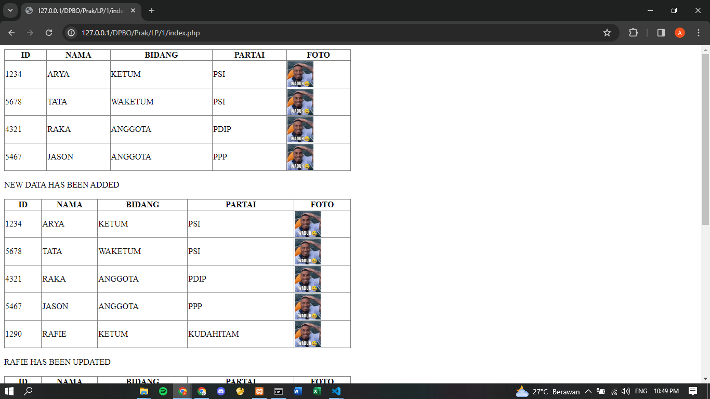
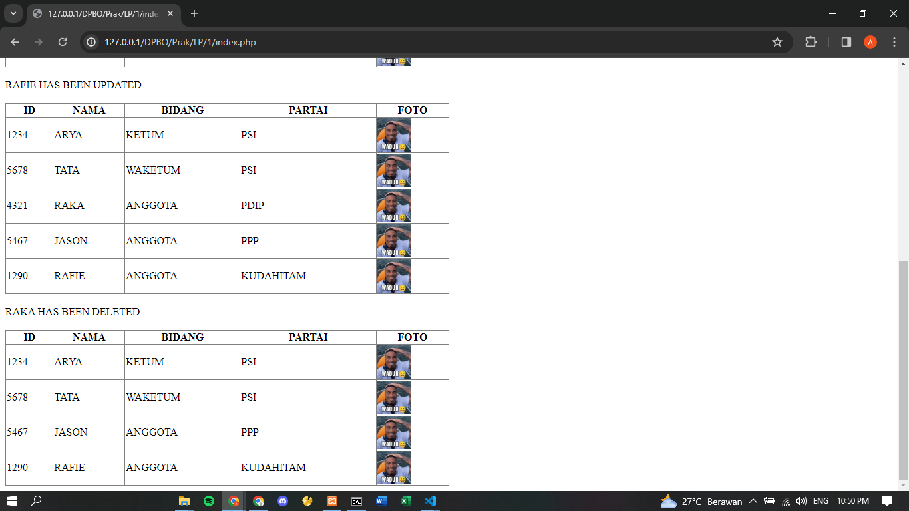
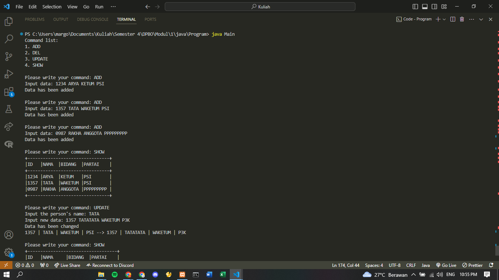
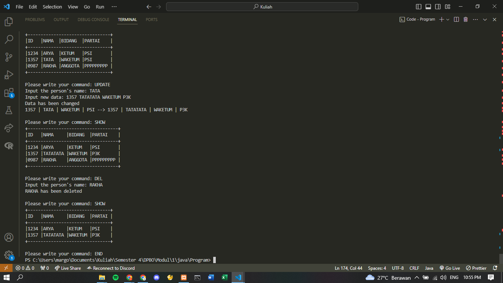
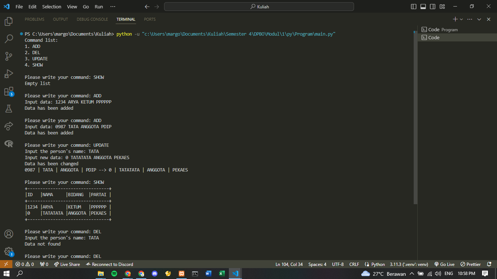
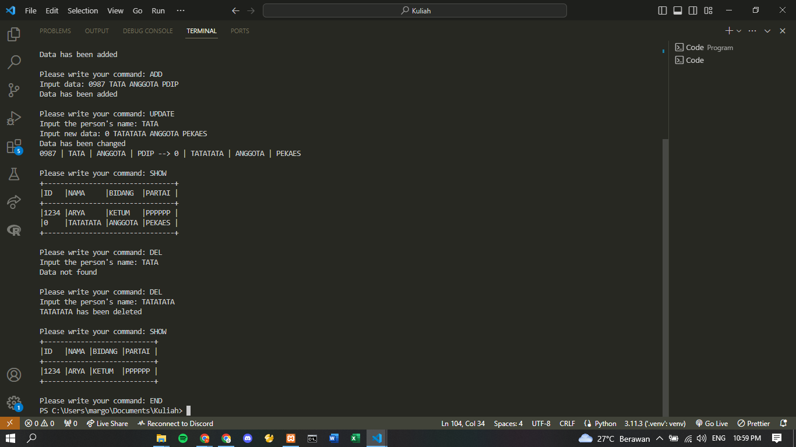
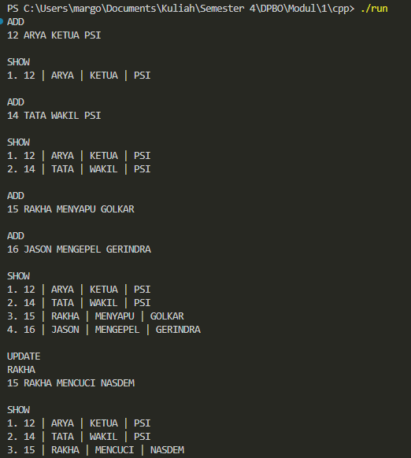
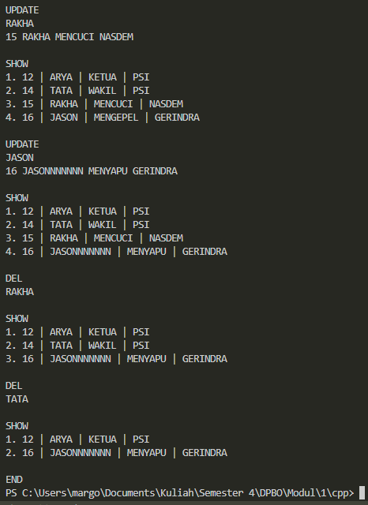

## Janji
*Saya Arya Aydin Margono NIM 2203484 mengerjakan
Latihan Praktikum 1 dalam mata kuliah DPBO
untuk keberkahanNya maka saya tidak melakukan kecurangan seperti yang telah dispesifikasikan. Aamiin.*

## Desain
Terdiri dari 1 Class, yaitu Anggota yang terdiri dari atribut-atribut berikut:
1. ID
2. Nama
3. Bidang
4. Partai
5. Foto (Hanya di PHP)

## Alur
1. Setelah di-run, maka user bisa memilih salah satu dari lima command berikut:
   - `ADD` untuk menambah data baru. Format penulisannya sebagai berikut: {ID}(spasi){Nama}(spasi){Bidang}(spasi){Partai}
   - `DEL` untuk menghapus data. User memasukkan Nama anggota yang ingin dihapus.
   - `UPDATE` untuk mengubah data. User memasukkan Nama anggota yang ingin diubah, lalu memasukkan format yang sama seperti command ADD.
   - `SHOW` untuk menampilkan semua data.
   - `END` untuk menghentikan program
2. Command yang dimasukkan bersifat tidak case-sensitive. Artinya, penulisan huruf kecil seperti `add` akan tetap menjalankan command `ADD`.
3. Jika command yang dimasukkan tidak ada dalam daftar kelima command, maka program akan mengeluarkan pesan *COMMAND NOT RECOGNIZED*.
4. Program akan terus meminta input sampai user memasukkan command `END` pada terminal.

## Dokumentasi

### PHP

### Java

### Python

### CPP

